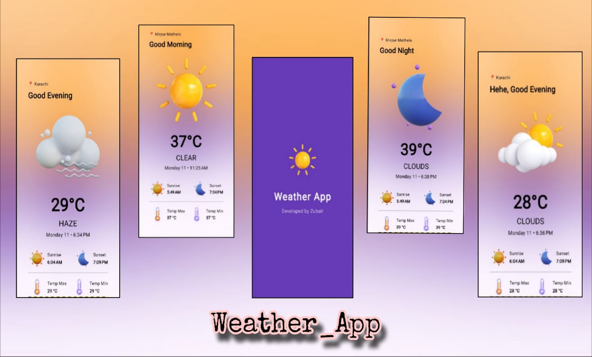

# 🌦️ **Weather App by Zubair**

A clean and responsive **Flutter Weather App** that provides **real-time weather updates** for any city in the world.  
Built using the **OpenWeatherMap API**, this app is lightweight, fast, and ideal for learning and showcasing in your portfolio.

---

## **✨ Features**
- 🌡️ **Temperature**, **humidity**, and **weather conditions**
- 🖌️ **Clean & minimal UI**
- 🔄 **Real-time API integration (OpenWeatherMap)**  
- 📱 **Responsive** on Android, iOS, and Web

---

## **🛠️ Tech Stack**
- **Flutter (Dart)**  
- **OpenWeatherMap API**  
- **http** package for API calls

---

  

